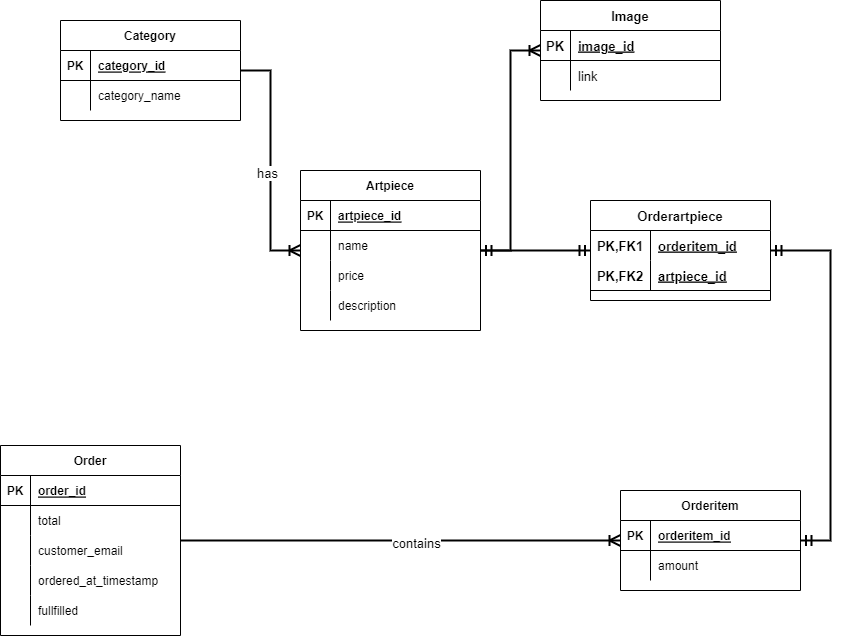
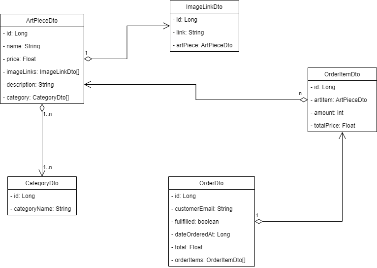

# store-backend

Backend for a simple store

## Table of contents

* [General Info](#general-info)
    * [Project definition](#project-definition)
    * [Features](#features)
* [Technologies](#technologies)
    * [Database Model](#database-model)
    * [Class Diagram](#class-diagram)
    * [Dependencies](#dependencies)

## General info

### Project definition

Simple store without payment option (for now) built for a friend's mom

### Features

- CRUD operations with ArtPiece-& Category-objects in the PostgreSQL database

## Technologies

- Java 17
- Java Spring Boot 2.6.6
- PostgreSQL as database

### Database Model



### Class Diagram



### Dependencies

```
<dependencies>
    <dependency>
        <groupId>org.springframework.boot</groupId>
        <artifactId>spring-boot-starter-web</artifactId>
    </dependency>

    <dependency>
        <groupId>org.springframework.boot</groupId>
        <artifactId>spring-boot-devtools</artifactId>
        <scope>runtime</scope>
        <optional>true</optional>
    </dependency>
    <dependency>
        <groupId>org.springframework.boot</groupId>
        <artifactId>spring-boot-starter-security</artifactId>
    </dependency>
    <dependency>
        <groupId>org.postgresql</groupId>
        <artifactId>postgresql</artifactId>
        <scope>runtime</scope>
    </dependency>
    <dependency>
        <groupId>org.projectlombok</groupId>
        <artifactId>lombok</artifactId>
        <optional>true</optional>
    </dependency>
    <dependency>
        <groupId>org.springframework.boot</groupId>
        <artifactId>spring-boot-starter-test</artifactId>
        <scope>test</scope>
    </dependency>
    <dependency>
        <groupId>org.springframework.boot</groupId>
        <artifactId>spring-boot-starter-data-jpa</artifactId>
    </dependency>
</dependencies>
```